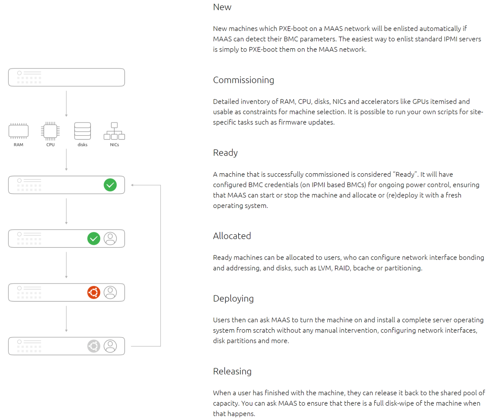

LernMAAS
========

Quelle: [MAAS How its works](https://maas.io/how-it-works)

- - - 

MAAS / IAAS Umgebung um Cluster von VMs oder Kubernetes auszusetzen

[MAAS](https://maas.io/how-it-works) steht für Self-Service-Remote-Installation von Windows, CentOS, ESXi und Ubuntu auf realen Servern. Es verwandelt das Rechenzentrum in eine Bare-Metal-Cloud.

In Zukunft soll das Shellscript [clusteradm](https://github.com/mc-b/lernkube/blob/master/clusteradm.md) durch die [MAAS](https://maas.io/) Lösung ersetzt bzw. ergänzt werden. Damit soll eine Umgebung mit mehreren [lernkube](https://github.com/mc-b/lernkube)-Clustern einfach erstellt, gewartet und überwacht werden.

Das ist u.a. wichtig wenn pro Modul oder Unterrichtsraum ein eigener Cluster zur Verfügung steht. 

Lehrbeauftragte und Dozenten sollen via Web Oberfläche, einfach [lernkube](https://github.com/mc-b/lernkube)-Cluster erstellen, warten und überwachen können.

Voraussetzungen
---------------

* Ein Netzwerk mit direkter Verbindung ins Internet aber ohne DHCP Server. Informationen zu Gateway und DNS Server.
* Ein handelsüblicher PC laut Anforderungen des [MAAS](https://maas.io/docs/maas-requirements) Projektes, als Master.
* Eine oder mehrere PCs mit 32 GB RAM, 256 GB HD und wenn möglich mit [BMC](https://de.wikipedia.org/wiki/Baseboard_Management_Controller) Unterstützung. Diese dienen als Virtualisierungs-Server.

Installation
------------

Für eine detailierte Installation, siehe [MAAS](MAAS/) oder [Bare Metal to Kubernetes-as-a-Service - Part 1](https://www.2stacks.net/blog/bare-metal-to-kubernetes-part-1/).

### Master
 
Mittels Download von [Ubuntu](https://ubuntu.com/download/desktop) als Desktop aufsetzen. Dabei genügt die minimale Version. 

Fixe IP-Adresse vergeben, z.B. über Einstellungen, Software Update durchführen und MAAS Installieren

    sudo add-apt-repository ppa:maas/stable -y  
    sudo apt update
    sudo apt upgrade -y
    sudo apt install -y maas jq 

MAAS Admin User erstellen 

    sudo maas init --admin-username ubuntu --admin-password password --admin-email xx.yy@zz.ch
    
SSH-Key erstellen, den brauchen wir nachher

    ssh-keygen    

Browser starten und UI von MAAS aufrufen [http://localhost:5240](http://localhost:5240)

* SSH-Key, von vorher `cat ~/.ssh/id_rsa.pub`  eintragen
* DNS Server eintragen. 
* Bei Subnets DHCP Server aktivieren auf z.B. 172.16.17.x, Gateway IP: 172.16.17.1 und DNS Server eintragen

**Server frisch starten, ansonsten werden die Änderungen nicht übernommen.**

* Images syncen  

**Tip**: vino auf dem Master installieren, damit ist der GUI via VNC erreichbar.

### Worker Nodes   

Die Worker Nodes sind so zu Konfigurieren, dass sie via Netzwerk (PXE Boot) booten.

Anschliessend sind die zwei Installationsroutingen durchzuführen. 

- - -

MAAS Enlistment 

---

MAAS Commission 

- - -

Die neue Maschine anklicken und rechts oben mittels `Take action` -> Deploy die Software deployen (Ubuntu 18.04). Um auf der Maschine nachher virtuelle Maschinen erstellen zu können ist die Checkbox `Register as MAAS KVM host` zu aktivieren.

Nach der Installation steht die Maschine unter Pods zur Verfügung und es lassen sich neue virtuelle Maschinen darauf erstellen (Compose).

**Tips** 
* Normale PCs haben keine Unterstützung für [BMC](https://de.wikipedia.org/wiki/Baseboard_Management_Controller) deshalb muss der `Power type` auf `Manuel` eingestellt werden. Sollte das nicht funktionieren, zuerst bei `Configuration` unter `Power type`  IPMI und eine Pseudo IP und MAC Adresse eingeben und nachher auf `Manuel` wechseln.
* PCs mittels `Lock` vor unbeabsichtigtem Ändern schützen.

Maschinen Life Cycle
--------------------

Quelle: [MAAS How its works](https://maas.io/how-it-works)

- - -

Jede von MAAS verwaltete Maschine durchläuft einen Lebenszyklus - von der Registrierung (New), der Inventarisierung und Einrichtung von Firmware (Ready) oder anderen hardwarespezifischen Elementen (Commissioning). Anschließend erfolgt die Bereitstellung (Deploy) um sie schliesslich zurück in den Ruhestand (Ready) zu entlassen.

Neue VMs lassen sich über die [MAAS Weboberfläche](http://localhost:5240) oder via [MAAS CLI](MAAS/CLI.md) erstellen.

Über die Weboberfläche sind `Pods` (die Bare Metal Maschinen mit KVM) und anschliessend `Compose` aufzurufen.

Die Maschinen erscheinen dann als `Ready` und es kann via [MAAS Weboberfläche](http://localhost:5240) mittels `Deploy` Ubuntu darauf installiert werden. 

Eine Installation weiterer Software ist in MAAS nicht vorgesehen, bzw. lässt sich nur durch [Anpassen](MAAS/Customising.md) von MAAS erreichen.

Als Alternative kann [Juju](Juju/) verwendet werden. Damit lassen sich Kubernetes Cluster oder mehrere VMs mit Software, z.B. 24 VMs mit Apache, installieren.
    
## Links

* [Bare Metal to Kubernetes-as-a-Service - Part 1](https://www.2stacks.net/blog/bare-metal-to-kubernetes-part-1/)
* [MAAS Blog Übersicht](https://ubuntu.com/blog/tag/maas)
