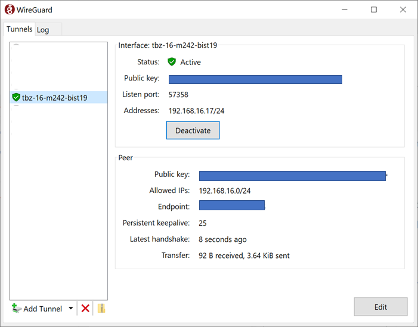

Auf den nachfolgenden Tabs stehen Server und VPN Informationen für deren Zugriff zur Verfügung.

Vorgehen
--------

Vervöllständigen der VPN Konfigurationsdatei, aus den Unterlagen mit Client Key und IP-Adresse.

Die Konfigurationsdatei sieht in etwa so aus:

    [Interface]
    Address = <replace IP>/24
    PrivateKey = <replace Key>
    
    [Peer]
    PublicKey = xxxxxxxxxxxxxxxxxxxxxxxxxxxxxxxxx
    Endpoint  = yyyyyyyyyy:518zz
    
    AllowedIPs = 192.168.zz.0/24
    
    # This is for if you're behind a NAT and
    # want the connection to be kept alive.
    PersistentKeepalive = 25
    
Die Einträge `<replace IP>` und `replace Key` sind durch die Einträge auf den nachfolgenden Tab zu ersetzen.

Installieren der VPN Software [WireGuard](https://www.wireguard.com/install/) und Starten.

Hinzufügen der Konfigurationsdatei (von oben) mittels **Add Tunnel**

Aktivieren des Tunnels, wechseln auf den entsprechenden Server Tab.

Der Server sollte jetzt verfügbar sein.
